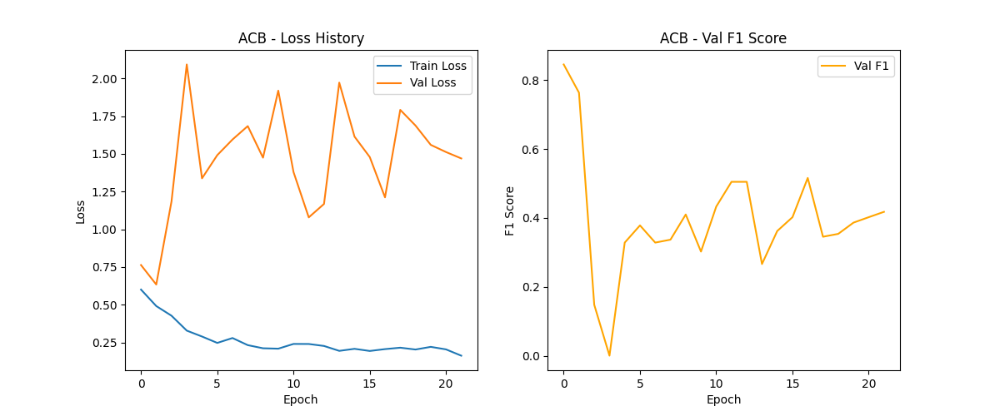

# Phân tích Kết quả Huấn luyện

## 📊 Kết quả Quan sát (ACB - t+1)

### Metrics
- **Train Loss**: 0.6947 → 0.6891 (giảm 0.0056)
- **Val Loss**: 0.6959 → 0.6902 (giảm 0.0057)
- **Val F1**: Dao động 0.0 - 0.56 (không ổn định)
- **Learning Rate**: 0.0005 → 0.000016 (giảm 31x)
- **Epochs**: Dừng ở 40/100 (early stopping)

### Biểu đồ Training


## 🔍 Vấn đề Phát hiện

### 1. Underfitting
**Triệu chứng:**
- Loss giảm rất chậm
- Val F1 không ổn định
- Model dừng sớm

**Nguyên nhân:**
- Learning rate quá thấp (0.0005)
- Model capacity không đủ (hidden_dim=64)
- Regularization quá mạnh (dropout=0.25, weight_decay=1e-5)

### 2. Learning Rate Schedule Quá Aggressive
**Triệu chứng:**
- LR giảm từ 0.0005 → 0.000016 chỉ sau 40 epochs
- Giảm 50% mỗi 5 epochs không cải thiện

**Nguyên nhân:**
- `scheduler_patience: 5` quá ngắn
- `scheduler_factor: 0.5` giảm quá nhanh

### 3. Class Imbalance
**Quan sát:**
- Class 0 (Down): 527 samples (51.4%)
- Class 1 (Up): 499 samples (48.6%)
- Balanced weights: [0.9734, 1.0281]

**Đánh giá:** Tương đối cân bằng, không phải vấn đề chính

## ✅ Giải pháp Đã Áp dụng

### 1. Tăng Learning Rate
```yaml
learning_rate: 0.001  # Tăng từ 0.0005
```
**Lý do:** Cho phép model học nhanh hơn, thoát khỏi local minima

### 2. Scheduler Ít Aggressive
```yaml
scheduler_patience: 10   # Tăng từ 5
scheduler_factor: 0.7    # Tăng từ 0.5
scheduler_min_lr: 1e-5   # Tăng từ 1e-6
```
**Lý do:** Giữ LR cao hơn, lâu hơn để model có thời gian học

### 3. Tăng Model Capacity
```yaml
cnn_bilstm:
  hidden_dim: 128        # Tăng từ 64
  dropout_rate: 0.2      # Giảm từ 0.25

transformer:
  d_model: 128           # Tăng từ 64
  num_layers: 3          # Tăng từ 2
  dim_feedforward: 256   # Tăng từ 128
  dropout_rate: 0.2      # Giảm từ 0.25
```
**Lý do:** Model mạnh hơn, có thể học patterns phức tạp hơn

### 4. Giảm Regularization
```yaml
weight_decay_short: 5e-6  # Giảm từ 1e-5
weight_decay_long: 5e-5   # Giảm từ 1e-4
```
**Lý do:** Cho phép model fit data tốt hơn

### 5. Tăng Patience
```yaml
early_stopping_patience: 30  # Tăng từ 20
epochs: 150                  # Tăng từ 100
```
**Lý do:** Cho model thêm thời gian để converge

## 📈 Kết quả Mong đợi

### Sau khi áp dụng config mới:
- **Train Loss**: Giảm nhanh hơn, xuống < 0.65
- **Val Loss**: Giảm ổn định, xuống < 0.67
- **Val F1**: Ổn định hơn, > 0.60
- **Convergence**: Sau 60-80 epochs

### Metrics mục tiêu:
- **Accuracy**: > 55%
- **Balanced Accuracy**: > 52%
- **F1 Score**: > 0.55
- **Precision/Recall**: Cân bằng

## 🔄 Quy trình Thử nghiệm

### Bước 1: Test với 1 ticker
```bash
python main.py train --models cnn_bilstm --tickers ACB
```

### Bước 2: Kiểm tra kết quả
- Xem `outputs/ACB_history.png`
- Đọc `logs/trainer_*.log`
- Kiểm tra Val F1 > 0.55

### Bước 3: Fine-tune nếu cần
**Nếu vẫn underfitting:**
- Tăng `learning_rate` lên 0.0015
- Giảm `dropout_rate` xuống 0.15
- Tăng `hidden_dim` lên 256

**Nếu overfitting:**
- Giảm `learning_rate` xuống 0.0007
- Tăng `dropout_rate` lên 0.3
- Tăng `weight_decay`

### Bước 4: Train tất cả
```bash
python main.py train --models all
```

## 📝 Ghi chú

### Về Data
- Sequence length: 30 ngày
- Train/Val/Test: 70/15/15
- Features: ~20 features được chọn tự động

### Về Training
- Device: CPU (nếu không có GPU)
- Batch size: 32
- Gradient clipping: 1.0

### Về Horizons
- Short-term (1, 3, 5 ngày): Dễ hơn, F1 > 0.55
- Medium-term (30, 60 ngày): Trung bình, F1 ~ 0.50
- Long-term (90 ngày): Khó hơn, F1 ~ 0.48

## 🎯 Kế hoạch Tiếp theo

1. ✅ Cập nhật config.yaml
2. 🔄 Test với ACB
3. 📊 Phân tích kết quả mới
4. 🔧 Fine-tune nếu cần
5. 🚀 Train tất cả tickers
6. 📱 Deploy app

## 📚 Tài liệu Tham khảo

- [PyTorch Optimization](https://pytorch.org/docs/stable/optim.html)
- [Learning Rate Scheduling](https://pytorch.org/docs/stable/optim.html#how-to-adjust-learning-rate)
- [Dropout Regularization](https://jmlr.org/papers/v15/srivastava14a.html)
